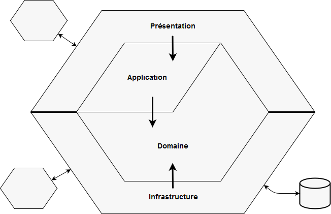

# Architecture hexagonale et CQRS

Ce projet est une implémentation de 2 types d'architectures complémentaires.

Elle n'a pas pour but d'expliquer ce qu'est le DDD mais d'en présenter une implémentation sous forme d'_architecture hexagonale et CQRS_ dans le contexte d'une API REST SpringBoot.

## Architecture hexagonale

L'architecture hexagonale mise en place est représentée par 4 couches :

 

 

### Présentation

La couche Présentation représente le point d'entrée de l'API. Elle contient les contrôleurs de l'application, effectue le contrôle des inputs et renvoie des outputs. C'est le contrat avec l'extérieur.

Elle a une dépendance vers la couche Application qui elle même a une dépendance vers la couche Domaine. La couche Présentation a donc elle aussi accès à la couche Domaine.

### Application

La couche Application contient la logique applicative et sert à faire le lien entre plusieurs agrégats. _Les agrégats sont une notion centrale en DDD, nous y revenons dans la couche Domaine._

### Domaine

La couche Domaine n'a pas de dépendance vers les autres couche et contient la _logique Métier_ de l'application, c'est-à-dire les entités du domaine regroupées en agrégats.

Un agrégat est un ensemble d'entités que l'on peut voir comme une unité. Souvent, il porte le nom de son entité racine. Une entité racine est le point d'entrée d'un agrégat. Les autres entités n'ont pas lieu d'être sans cette entité racine.

Un exemple simple : l'adresse postale du client d'une boutique n'a pas d'intérêt seule. Client et Adresse sont deux entités distinctes qui forment un agrégat dont l'entité racine est Client. On peut nommer cet agrégat Client.

La couche Domaine contient aussi :
* Les interfaces des Repository implémentées dans la couche infrastructure
* La définition des Commands et Queries
* Les classes d'exceptions

### Infrastructure

Le domaine définit ce que le Repository *doit* faire. L'infrastructure implémente *comment* le faire.

Elle permet d'accéder aux partenaires externes. C'est ici qu'on trouve le "bruit technique" (accès à une base de données, à une ressource externe, etc.). Les interfaces *génériques* définies dans la couche Domaine sont implémentées de manière *spécifique* dans la couche Infrastructure.

## CQRS

Une architecture CQRS sépare de manière explicite la logique applicative contenant la gestion de l'écriture de celle de la lecture.

Un aspect important du CQRS est de simplifier la lecture en préparant les données, autrement appelées "vues", lors de la phase d'écriture. Cela implique de gérer un maximum des traitements lors de l'écriture et un minimum lors de la lecture.

/!\ Cela peut avoir un impact sur la complexité du code, il faut éviter de vouloir à tout prix tout préparer lors de l'écriture et faire au cas par cas.

_A compléter avec un schéma_